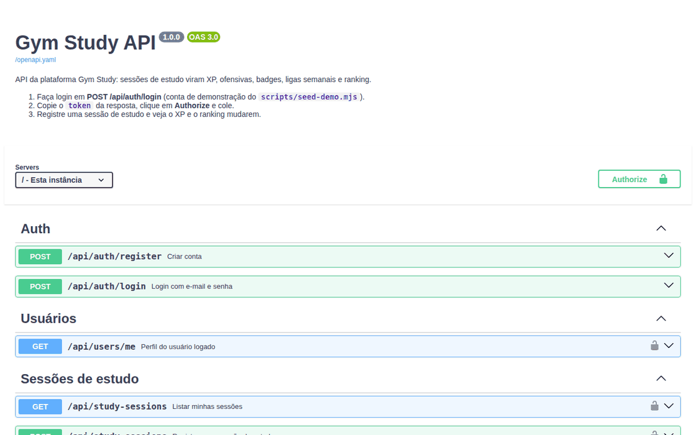

<h1 align="center">
  Gym Study · Back
</h1>

<p align="center">
  
</p>

<p align="center">
  <a href="https://skillicons.dev">
    
  </a>
</p>

## Qual a finalidade do projeto?

API do **Gym Study**, uma plataforma de estudos gamificada para quem estuda tecnologia. Ela recebe as sessões de estudo e transforma cada uma em **XP**, **ofensiva**, **badges com níveis**, **conquistas**, **ligas semanais** e **ranking**. Também cuida da parte social: amigos, feed, stories, grupos e desafios.

O processamento pesado roda fora da requisição: XP, badges, conquistas, notificações e e-mails passam por **filas BullMQ no Redis**, e rotinas como virada da liga, reset de XP semanal e quebra de ofensiva rodam em **cron jobs**.

O front que consome esta API é o [gym-study-front](https://github.com/gym-study-org/gym-study-front).

## Arquitetura

<p align="center">
  
</p>

## O que foi construído

### Módulos da API

| Prefixo | O que faz |
|---|---|
| `/api/auth` | Cadastro, login, refresh e logout (JWT) |
| `/api/users` | Perfil, edição e avatar |
| `/api/study-sessions` | Registro de sessões e estatísticas |
| `/api/certifications`, `/api/goals` | Certificações e metas de estudo |
| `/api/xp`, `/api/streak`, `/api/quests` | XP e nível, ofensiva com freeze, missões do dia |
| `/api/badges`, `/api/achievements` | Badges com níveis e conquistas |
| `/api/leagues`, `/api/ranking` | Ligas semanais (Bronze → Diamante) e rankings |
| `/api/feed`, `/api/stories` | Posts, curtidas, comentários e stories |
| `/api/friendships`, `/api/groups`, `/api/challenges` | Amigos, grupos de estudo e desafios |
| `/api/gems` | Moeda do app e loja |
| `/api/articles`, `/api/recommendations` | Artigos e recomendações entre usuários |
| `/api/github` | Conexão com o GitHub e sync de contribuições |
| `/api/public` | Perfil público e verificação de badges, sem login |
| `/health` | Health check |

A documentação interativa fica em **`/docs`** (Swagger UI), gerada de [`docs/openapi.yaml`](docs/openapi.yaml).

### Tarefas em segundo plano

| Tipo | Tarefa |
|---|---|
| Fila (BullMQ) | XP, badges, conquistas, notificações, e-mails e sync do GitHub |
| Cron | Ofensivas (meia-noite), ranking (1h), limpeza (3h), missões do dia (0h05), reset de XP e promoção de liga (segunda), resumo semanal por e-mail |

### Banco de dados

29 migrations SQL em `src/database/migrations`, aplicadas automaticamente na subida da API e registradas na tabela `schema_migrations`.

## Tecnologias utilizadas

- **Node.js 20 + Express + TypeScript:** API REST;
- **Socket.io + adapter Redis:** tempo real, pronto para várias instâncias;
- **PostgreSQL 16 (`pg`):** banco relacional, com SQL puro;
- **Redis 7 (`ioredis`) + BullMQ:** cache e filas;
- **MinIO (`@aws-sdk/client-s3`):** armazenamento dos avatares, compatível com S3;
- **Zod:** validação das requisições e das variáveis de ambiente;
- **JWT + bcrypt:** autenticação;
- **Nodemailer + Handlebars:** e-mails;
- **Helmet, CORS e rate limit:** segurança;
- **Jest + Supertest:** testes;
- **Docker + GitHub Actions:** imagem publicada no GitHub Container Registry.

## Estrutura do repositório

```text
gym-study-back/
├── src/
│   ├── modules/<módulo>/      # routes, controllers, services, validators
│   ├── database/migrations/   # 001 a 029 (.sql)
│   ├── jobs/                  # Cron jobs
│   ├── shared/queue/          # Filas e workers BullMQ
│   ├── websocket/             # Socket.io
│   ├── config/                # Ambiente, banco, Redis, storage
│   ├── app.ts                 # Express
│   └── server.ts              # Migrations + HTTP + Socket.io
├── docs/
│   ├── openapi.yaml           # Especificação da API
│   ├── api-demo.gif           # Demonstração no Swagger UI
│   └── arch.gif               # Diagrama da arquitetura
├── scripts/seed-demo.mjs      # Dados de exemplo
├── tests/
├── docker-compose.yml         # PostgreSQL + Redis para desenvolvimento
├── Dockerfile
└── README.md
```

## Fluxo de funcionamento

1. O usuário faz login em `POST /api/auth/login` e recebe um JWT.
2. Ao terminar de estudar, o front envia `POST /api/study-sessions`.
3. A API grava a sessão, soma as horas e atualiza a ofensiva.
4. XP, badges e conquistas são calculados em segundo plano pelas filas BullMQ.
5. O XP da semana define a posição na liga e no ranking.
6. Conquistas e novidades chegam ao front pelo Socket.io.
7. Toda segunda-feira, os cron jobs promovem os primeiros da liga e zeram o XP semanal.

## Rodando a API localmente

A stack completa (front, API, banco, Redis e MinIO) sobe pelo [gym-study-infra](https://github.com/gym-study-org/gym-study-infra).

Só a API:

```bash
cp .env.example .env              # troque o JWT_SECRET
docker compose up -d              # PostgreSQL e Redis
npm install
npm run dev                       # http://localhost:5000/docs
node scripts/seed-demo.mjs        # usuários e dados de exemplo
```

Login de demonstração: `ana@gymstudy.dev` / `Demo1234`.

## Como validar a entrega

Em uma validação end-to-end, registrar uma sessão de estudo deve aumentar o XP do usuário e mudar a posição dele no ranking.

Pontos principais de validação:

- `GET /health` respondendo `200`;
- migrations aplicadas na primeira subida, com o banco vazio;
- `POST /api/auth/register` e `POST /api/auth/login` devolvendo o token;
- `POST /api/study-sessions` respondendo `201`;
- `GET /api/xp/me` mostrando o XP novo alguns segundos depois;
- `GET /api/ranking/weekly` e `GET /api/leagues/current` com a posição atualizada;
- `/docs` abrindo o Swagger UI;
- `npm test` passando (com o Redis do `docker compose` no ar).

## Projeto Gym Study

| Repositório | Camada |
|---|---|
| [gym-study-front](https://github.com/gym-study-org/gym-study-front) | Web app (Next.js) |
| **gym-study-back** | API (Express + PostgreSQL + Redis) |
| [gym-study-infra](https://github.com/gym-study-org/gym-study-infra) | Stack completa com Docker Compose |

## Autor

**William Alves Coelho** · [@willtechdev](https://github.com/willtechdev)
